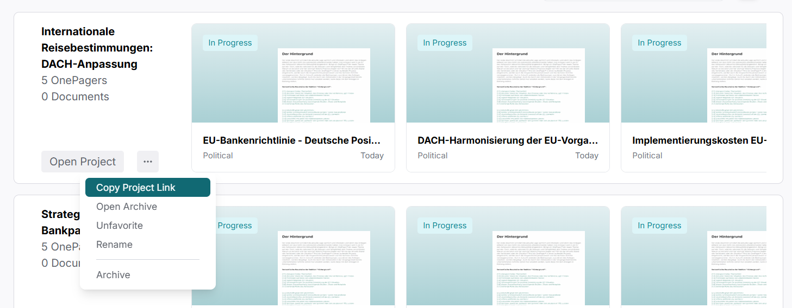

# OnePager Architect

## Project Overview

This project was developed during the **JavaScript Technologies Practical Course** at the **Technical University of Munich** in the **Winter Semester 2024/2025**. The course aims to provide students with practical experience in large-team development, utilizing modern JavaScript technologies and frameworks to create products for real clients.

As a member of the frontend team, I contributed to the development of **OnePager Architect**, a web application designed to enable users to create and manage professional one-pager documents. These concise, single-page documents summarize key information about a project, product, or idea, commonly used in business settings for quick overviews. In our application, these documents were generated using **AI and Machine Learning technologies**.

During development, the platform evolved into two core products:
- **[OnePager Architect](https://www.onepagerarchitect.com/)**: Original Product with focus on OnePager Generation with additional knowledge base and AI-improve features.
- **[AI Architect](https://production.d2vrchwb4w0u8r.amplifyapp.com/)**: A comprehensive resource to explore the fundamentals and advanced concepts of OnePager creation, including architecture, quality criteria, perspective change, and argumentation.

Due to legal restrictions, I cannot share the source code. However, I can briefly present some of the key features I worked on.

---
## My Contributions

As part of the frontend team, I was responsible for the structure and implementation of the **Home Page**, including all of its subcomponents. This also includes the **Project Tile** and **OnePager Tile** components, which are reused throughout the whole application. Additionally, I implemented the **Navigation Bar**, including its dynamic behavior and routing support.

For more detailed insights into these components, please refer to the documentation provided in this repository.

---
## Image Collection

More images can be found in the `README_IMG` folder.
## Tech Stack
Since my main focus was on frontend, I will only provide details about the technologies used in that part of the project.

### Frontend

- **Next.js** (v14.2.15) with **TypeScript**  
  Framework for building React applications, supporting SSR (server-side rendering) and SSG (static site generation)
- **App Router**  
  File-based routing system using the new `app/` directory
- **Radix UI** + **Tailwind CSS**  
  Component library paired with utility-first CSS for styling

  
## License

This repository only serves as a **portfolio showcase** of my contributions for the Project during the JST Practical. It is for personal use only and is intended as a reference point for the projects I have completed during my studies.